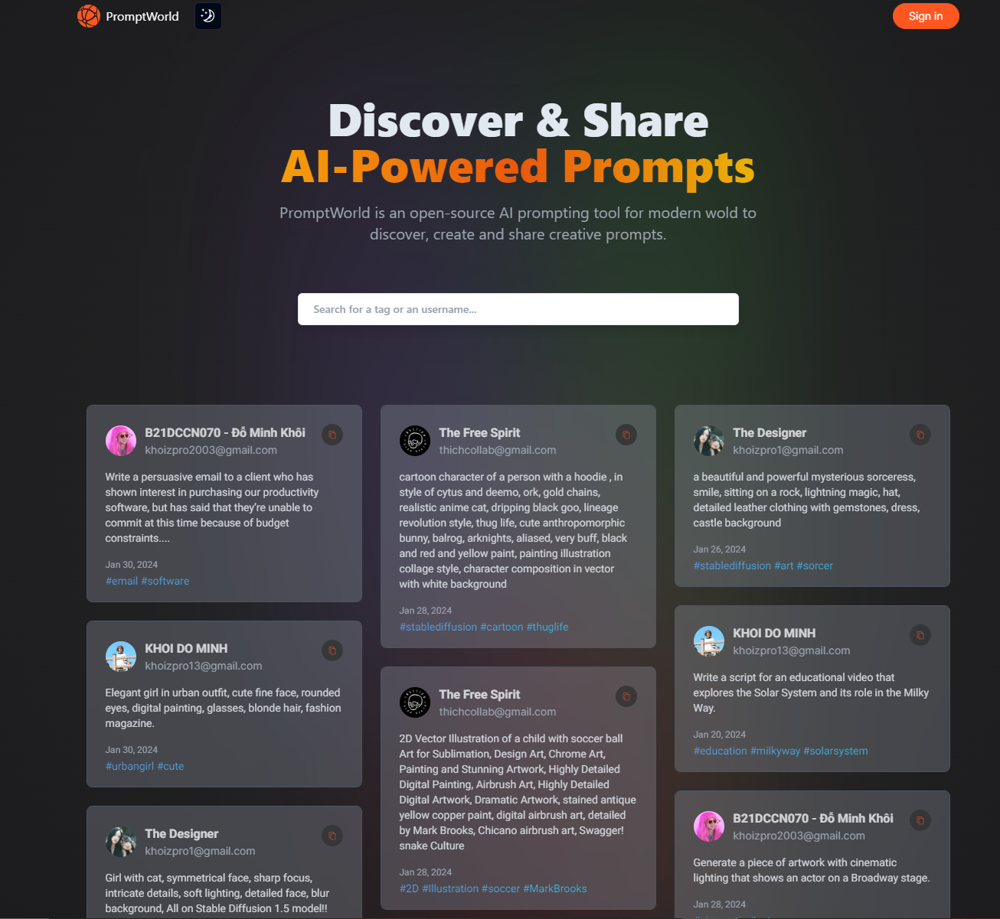
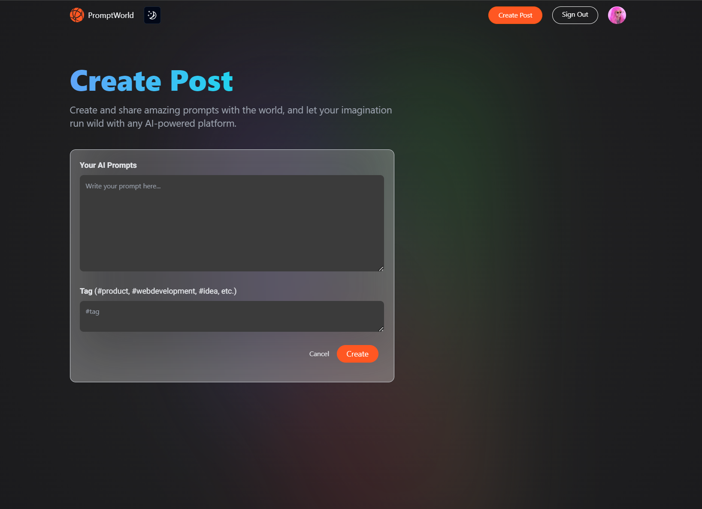
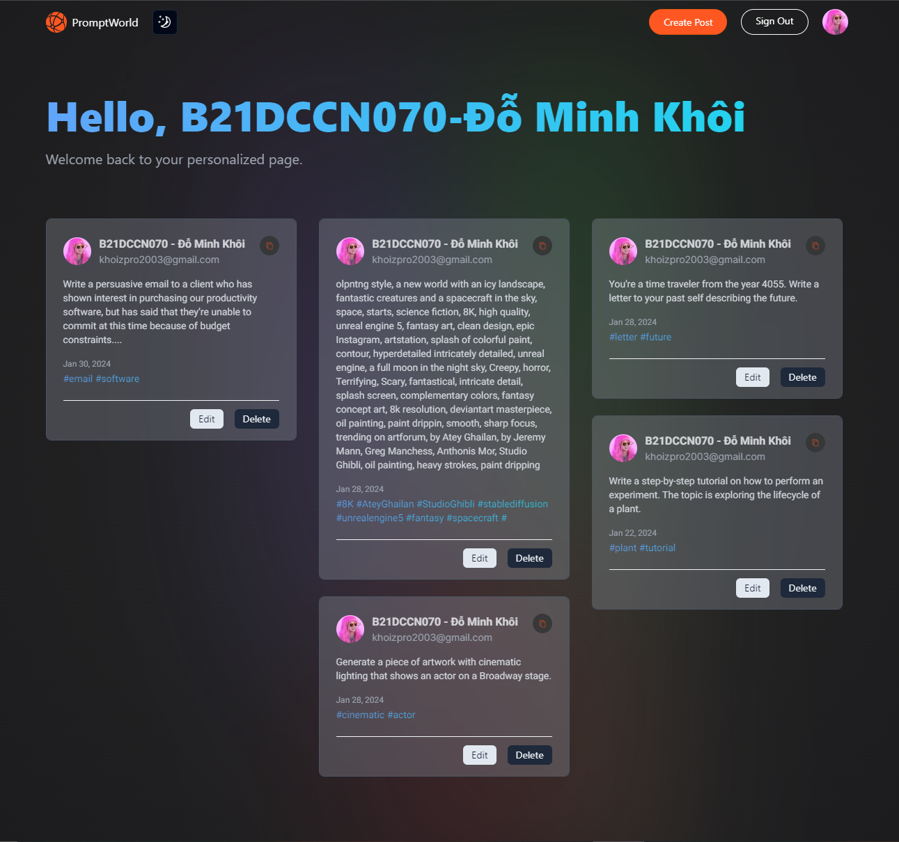

#  PromptWorld

## 🚀 Introduction

Welcome to PromptWorld – An open-source AI prompting tool for the modern world. PromptWorld allows users to create, discover, and share creative prompts that can be used to generate content for AI applications. Built with TypeScript, Next.js, Tailwind CSS, React Query, MongoDB, and utilizing shadcn/ui and next-authjs v4, PromptWorld provides an interactive platform for users to contribute and explore a variety of prompts.

## ✨ Features

- **Create Prompts:** Users can easily create and share their own prompts with the PromptWorld community. The platform provides a user-friendly interface to input and submit prompts.

- **Discover and Explore:** Explore a diverse range of prompts contributed by the community. Find inspiration for your next AI-powered project or creative endeavor.

- **Copy and Use:** Copy prompts directly from the platform to use in your AI applications. Whether you're working on natural language processing or creative writing, PromptWorld has a variety of prompts to suit your needs.

- **Dark Mode:** Enjoy a comfortable browsing experience with the built-in dark mode. Toggle between light and dark themes to suit your preference.

## 📷 Screenshots


_Explore a variety of creative prompts on the PromptWorld home page._


_Easily create and share your own prompts with the PromptWorld community._


_Discover diverse prompts contributed by the PromptWorld community._

## 🌐 Try it Out

Visit [PromptWorld](https://prompt-world.netlify.app/) to experience the platform!
# 

## 🛠️ Technologies Used

- **TypeScript:** Enhance your development experience with TypeScript's static typing, making your code more robust and maintainable.

- **Next.js:** Built on top of React, Next.js provides a powerful framework for building server-rendered React applications with ease.

- **Tailwind CSS:** Utilize a utility-first CSS framework to style your components quickly and maintain a consistent design throughout the application.

- **React Query:** Manage and fetch data seamlessly with React Query, providing a powerful and efficient solution for data fetching and caching.

- **MongoDB:** Store and retrieve prompts efficiently with MongoDB, a NoSQL database, ensuring scalability and flexibility.

- **shadcn/ui:** Utilize shadcn/ui for building elegant and customizable user interfaces, enhancing the visual appeal of PromptWorld.

- **next-authjs v4:** Implement authentication and user management seamlessly with next-authjs v4, providing a secure and reliable authentication solution for PromptWorld.

## 🌐 Getting Started

First, run the development server:

```bash
npm run dev
# or
yarn dev
# or
pnpm dev
# or
bun dev
```

Open [http://localhost:3000](http://localhost:3000) with your browser to see the result.

You can start editing the page by modifying `app/page.tsx`. The page auto-updates as you edit the file.

This project uses [`next/font`](https://nextjs.org/docs/basic-features/font-optimization) to automatically optimize and load Inter, a custom Google Font.

## 🤝 Contributing

We welcome contributions from the community. If you'd like to contribute to PromptWorld, please follow our contribution guidelines.

## 📄 License
PromptWorld is open-source code. Feel free to use, modify, and distribute the code

Happy prompting! 🚀

## Learn More

To learn more about Next.js, take a look at the following resources:

- [Next.js Documentation](https://nextjs.org/docs) - learn about Next.js features and API.
- [Learn Next.js](https://nextjs.org/learn) - an interactive Next.js tutorial.

You can check out [the Next.js GitHub repository](https://github.com/vercel/next.js/) - your feedback and contributions are welcome!

## Deploy on Vercel

The easiest way to deploy your Next.js app is to use the [Vercel Platform](https://vercel.com/new?utm_medium=default-template&filter=next.js&utm_source=create-next-app&utm_campaign=create-next-app-readme) from the creators of Next.js.

Check out our [Next.js deployment documentation](https://nextjs.org/docs/deployment) for more details.
